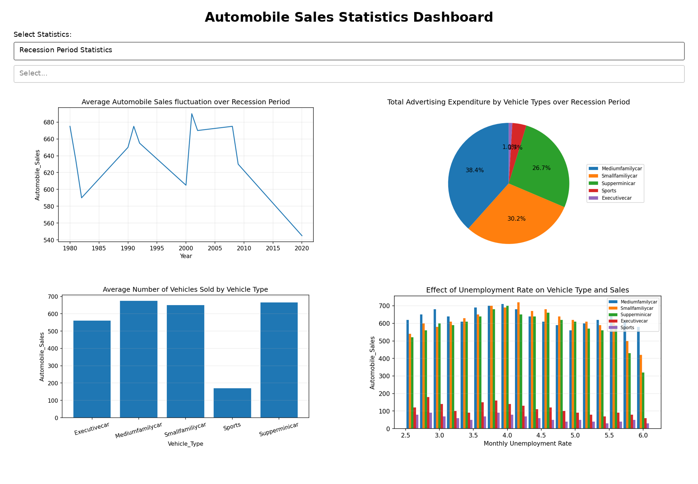
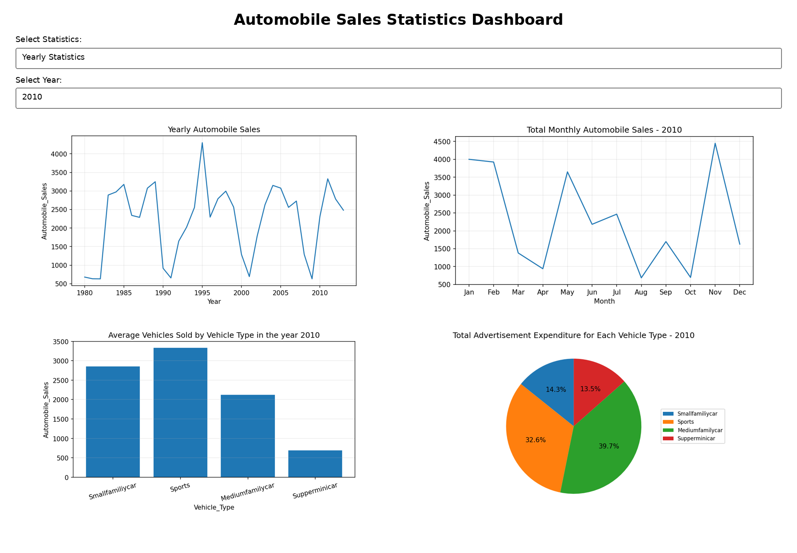

# Data Visualization with Python – Final Project

Final project completed as part of the **Data Visualization with Python** course on Coursera.

## Project Overview

The project analyzes historical automobile sales data and explores how economic recession periods affected vehicle sales.

The project is divided into two parts:

### Part 1 – Data Visualization

Created visualizations using:

- Matplotlib
- Seaborn
- Pandas
- Folium

The analysis includes:

- Annual automobile sales trends
- Advertising expenditure trends
- Recession vs non-recession sales
- Vehicle type comparisons
- GDP trends
- Seasonality effects
- Vehicle price vs sales
- Advertising expenditure distribution
- Unemployment rate impact on automobile sales

### Part 2 – Interactive Dashboard

Built an interactive dashboard using:

- Plotly
- Dash
- Pandas

The dashboard contains two reports:

#### Yearly Statistics

- Yearly automobile sales
- Monthly automobile sales
- Average sales by vehicle type
- Advertising expenditure by vehicle type

#### Recession Period Statistics

- Average automobile sales during recessions
- Average sales by vehicle type
- Advertising expenditure share
- Effect of unemployment rate on vehicle sales

## Project Files

- `DV0101EN-Final-Assign-Part1-RESUBMIT.ipynb` – Jupyter Notebook with the data analysis and visualizations
- `DV0101EN-Final-Assign-Part-2-COMPLETED.py` – Plotly Dash dashboard
- `RecessionReportgraphs.png` – Recession Statistics dashboard
- `YearlyReportgraphs.png` – Yearly Statistics dashboard

## Dashboard Preview

### Recession Period Statistics

### Yearly Statistics

## Technologies Used

- Python
- Pandas
- Matplotlib
- Seaborn
- Plotly
- Dash
- Jupyter Notebook

## Skills Practiced

- Data cleaning and aggregation
- Exploratory data analysis
- Data visualization
- Interactive dashboard development
- Callback functions in Dash
- Business data interpretation

## Course

**Data Visualization with Python**  
Coursera / IBM

---

This repository contains coursework completed for educational and portfolio purposes.
